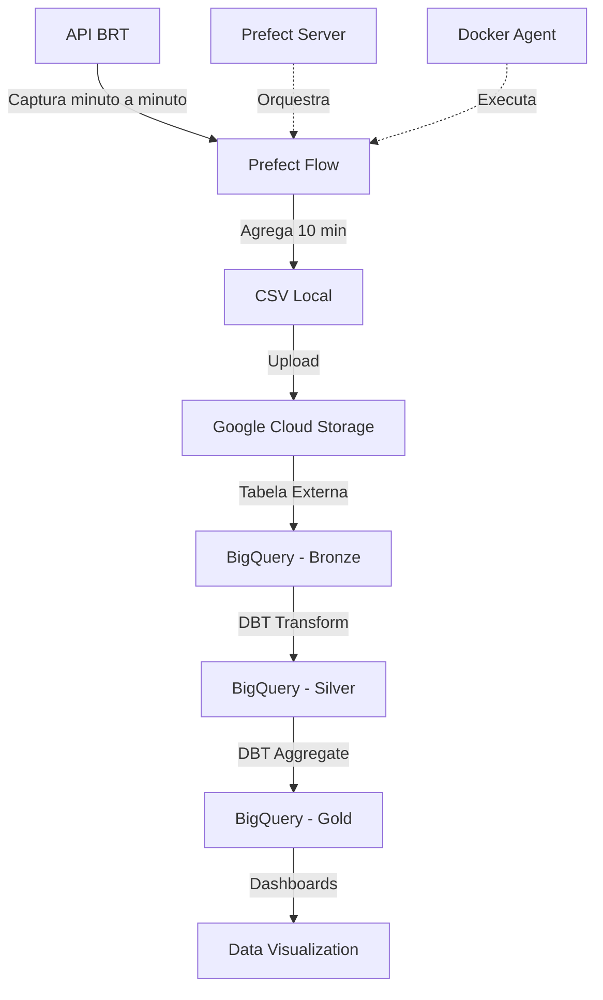

# 🚌 Desafio CIVITAS - Pipeline BRT Rio de Janeiro

[](https://docs.prefect.io/)
[](https://docs.getdbt.com/)
[](https://cloud.google.com/bigquery)
[](https://www.python.org/)

Pipeline de dados ELT para captura, armazenamento e transformação de dados GPS em tempo real dos veículos BRT do Rio de Janeiro, seguindo a **Arquitetura Medallion** (Bronze → Silver → Gold).

## 📋 Índice

- [Visão Geral](#-visão-geral)
- [Arquitetura](#-arquitetura)
- [Tecnologias](#-tecnologias)
- [Pré-requisitos](#-pré-requisitos)
- [Instalação](#-instalação)
- [Configuração](#-configuração)
- [Execução](#-execução)
- [Estrutura do Projeto](#-estrutura-do-projeto)
- [Modelos DBT](#-modelos-dbt)
- [Testes de Qualidade](#-testes-de-qualidade)
- [Monitoramento](#-monitoramento)
- [Troubleshooting](#-troubleshooting)

## 🎯 Visão Geral

Este projeto implementa um pipeline completo de dados que:

1. **Captura** dados GPS dos veículos BRT minuto a minuto via API
2. **Agrega** 10 minutos de dados em um único arquivo CSV
3. **Armazena** no Google Cloud Storage (GCS)
4. **Cria** tabela externa no BigQuery usando DBT
5. **Transforma** dados através de modelos DBT (camadas Silver e Gold)
6. **Documenta** automaticamente tabelas e colunas no BigQuery

### Arquitetura Medallion

```
┌─────────────────────────────────────────────────────────────┐
│                     ARQUITETURA MEDALLION                   │
├─────────────────────────────────────────────────────────────┤
│                                                             │
│  📡 API BRT                                                 │
│      ↓                                                      │
│  🥉 BRONZE (Raw Data)                                       │
│      • Captura minuto a minuto                              │
│      • CSV no GCS                                           │
│      • Tabela externa BigQuery                              │
│      ↓                                                      │
│  🥈 SILVER (Cleaned Data)                                   │
│      • Validação de coordenadas                             │
│      • Remoção de duplicatas                                │
│      • Campos derivados                                     │
│      • Views no BigQuery                                    │
│      ↓                                                      │
│  🥇 GOLD (Business Metrics)                                 │
│      • Métricas agregadas                                   │
│      • KPIs por linha e período                             │
│      • Tabelas particionadas                                │
│      • Pronto para dashboards                               │
│                                                             │
└─────────────────────────────────────────────────────────────┘
```

## 🏗️ Arquitetura



## 🛠️ Tecnologias

- **Orquestração**: Prefect 1.4.1
- **Transformação**: DBT (Data Build Tool) 1.5.0
- **Cloud**: Google Cloud Platform (GCS + BigQuery)
- **Containerização**: Docker & Docker Compose
- **Linguagem**: Python 3.8+
- **Logs**: Loguru

## 📦 Pré-requisitos

### Software Necessário

- Python 3.8 ou superior
- Docker & Docker Compose
- Git
- Conta Google Cloud Platform (nível gratuito disponível)

### Conta GCP

1. Criar projeto no [Google Cloud Console](https://console.cloud.google.com/)
2. Ativar APIs:
   - BigQuery API
   - Cloud Storage API
3. Criar Service Account com permissões:
   - BigQuery Admin
   - Storage Admin
4. Baixar arquivo JSON de credenciais

## 🚀 Instalação

### 1. Clone o Repositório

```bash
git clone https://github.com/seu-usuario/desafio-civitas-brt.git
cd desafio-civitas-brt
```

### 2. Crie Ambiente Virtual Python

```bash
# Windows (PowerShell)
python -m venv venv
.\venv\Scripts\Activate.ps1

# Linux/Mac
python3 -m venv venv
source venv/bin/activate
```

### 3. Instale Dependências

```bash
pip install --upgrade pip
pip install -r requirements.txt
```

### 4. Configure Credenciais GCP

Copie o arquivo de credenciais JSON para o diretório `config/`:

```bash
# Windows
New-Item -ItemType Directory -Force -Path config
Copy-Item caminho\para\suas-credenciais.json config\gcp-credentials.json

# Linux/Mac
mkdir -p config
cp /caminho/para/suas-credenciais.json config/gcp-credentials.json
```

## ⚙️ Configuração

### 1. Variáveis de Ambiente

Copie o arquivo de exemplo e configure:

```bash
# Windows
Copy-Item .env.example .env

# Linux/Mac
cp .env.example .env
```

Edite o arquivo `.env`:

```bash
# Google Cloud Platform
GCP_PROJECT_ID=seu-projeto-gcp
GCS_BUCKET_NAME=brt-data-civitas
GCP_CREDENTIALS_PATH=./config/gcp-credentials.json

# BigQuery
BQ_DATASET=brt_dataset

# API BRT
BRT_API_URL=https://jeap.rio.rj.gov.br/je-api/api/v2/gps

# Configurações do Pipeline
CAPTURE_INTERVAL_SECONDS=60
AGGREGATION_MINUTES=10

# Prefect
PREFECT_SERVER_HOST=0.0.0.0
PREFECT_SERVER_PORT=4200
```

### 2. Criar Bucket GCS

```bash
# Via gcloud CLI
gcloud storage buckets create gs://brt-data-civitas --location=US

# OU via console: https://console.cloud.google.com/storage
```

### 3. Criar Dataset BigQuery

```bash
# Via bq CLI
bq mk --location=US brt_dataset

# OU via console: https://console.cloud.google.com/bigquery
```

### 4. Instalar Dependências DBT

```bash
cd dbt_brt
dbt deps
cd ..
```

## 🎬 Execução

### Opção 1: Prefect Server + Docker Agent (Recomendado)

#### 1. Inicie os Serviços Docker

```bash
docker-compose up -d
```

Aguarde alguns segundos para os serviços iniciarem.

#### 2. Acesse o Prefect UI

Abra no navegador: [http://localhost:4200](http://localhost:4200)

#### 3. Registre o Flow

```bash
python pipeline/brt_flow.py register
```

#### 4. Execute o Flow via UI

No Prefect UI:
- Navegue até "Flows"
- Selecione "BRT Data Pipeline - Medallion Architecture"
- Clique em "Quick Run"

### Opção 2: Execução Local (Desenvolvimento)

```bash
# Execute o flow diretamente
python pipeline/brt_flow.py
```

### Teste Individual de Componentes

#### Teste Captura da API

```bash
python scripts/brt_api_capture.py
```

#### Teste Agregação

```bash
python scripts/brt_data_aggregator.py
```

#### Teste Upload GCS

```bash
python scripts/gcs_manager.py
```

#### Teste DBT

```bash
cd dbt_brt

# Cria tabela externa
dbt run-operation stage_external_sources

# Executa transformações
dbt run

# Executa testes
dbt test

# Gera documentação
dbt docs generate
dbt docs serve
```

## 📁 Estrutura do Projeto

```
desafio-civitas-brt/
├── 📄 README.md                    # Este arquivo
├── 📄 requirements.txt             # Dependências Python
├── 📄 docker-compose.yml           # Configuração Docker
├── 📄 .env.example                 # Exemplo de variáveis de ambiente
├── 📄 .gitignore
│
├── 📂 pipeline/                    # Fluxos Prefect
│   ├── __init__.py
│   └── brt_flow.py                 # Flow principal
│
├── 📂 scripts/                     # Scripts Python
│   ├── __init__.py
│   ├── brt_api_capture.py          # Captura da API
│   ├── brt_data_aggregator.py      # Agregação de dados
│   └── gcs_manager.py              # Gerenciamento GCS
│
├── 📂 dbt_brt/                     # Projeto DBT
│   ├── dbt_project.yml             # Configuração DBT
│   ├── profiles.yml                # Perfis de conexão
│   ├── packages.yml                # Dependências DBT
│   │
│   └── 📂 models/                  # Modelos DBT
│       ├── 📂 bronze/              # Camada Bronze
│       │   └── sources.yml         # Tabelas externas
│       │
│       ├── 📂 silver/              # Camada Silver
│       │   ├── stg_brt_gps_cleaned.sql
│       │   └── schema.yml
│       │
│       └── 📂 gold/                # Camada Gold
│           ├── fct_brt_line_metrics.sql
│           └── schema.yml
│
├── 📂 config/                      # Configurações
│   └── gcp-credentials.json        # Credenciais GCP (não versionado)
│
├── 📂 data/                        # Dados locais
│   ├── bronze/                     # Dados brutos
│   └── silver/                     # Dados processados
│
└── 📂 docs/                        # Documentação adicional
```

## 📊 Modelos DBT

### Camada Bronze

**`brt_gps_raw`** (Tabela Externa)
- Dados brutos da API BRT
- Armazenados em CSV no GCS
- Schema fixo com 8 colunas

### Camada Silver

**`stg_brt_gps_cleaned`** (View)
- ✅ Validação de coordenadas GPS
- ✅ Remoção de duplicatas
- ✅ Campos derivados (data, hora, dia da semana)
- ✅ Categorização de velocidade
- ✅ Identificação de período do dia

### Camada Gold

**`fct_brt_line_metrics`** (Tabela Particionada)
- 📈 Métricas agregadas por linha e período
- 📊 KPIs operacionais
- 🎯 Otimizada para dashboards
- 📅 Particionada por data
- 🔍 Clusterizada por linha e período

## 🧪 Testes de Qualidade

O projeto implementa testes DBT em múltiplos níveis:

### Testes de Schema

```yaml
# Coluna não pode ser nula
- not_null

# Coluna deve ser única
- unique

# Valores aceitos
- accepted_values:
    values: ['Manhã', 'Tarde', 'Noite', 'Madrugada']
```

### Testes de Relacionamento

```yaml
# Combinação de colunas única
- dbt_utils.unique_combination_of_columns:
    combination_of_columns:
      - date_partition
      - line
      - period_of_day
```

### Testes de Valores

```yaml
# Valores dentro de um intervalo
- dbt_expectations.expect_column_values_to_be_between:
    min_value: -23.0
    max_value: -22.7
```

### Executar Testes

```bash
cd dbt_brt
dbt test
```

## 📈 Monitoramento

### Prefect UI

Acesse: [http://localhost:4200](http://localhost:4200)

- ✅ Status de execução dos flows
- 📊 Histórico de runs
- ⏱️ Duração das tasks
- ❌ Logs de erros

### DBT Docs

```bash
cd dbt_brt
dbt docs generate
dbt docs serve
```

Acesse: [http://localhost:8080](http://localhost:8080)

- 📚 Documentação de modelos
- 🌳 Lineage de dados
- 📋 Schema das tabelas
- ✅ Resultados dos testes

### Logs do Pipeline

Logs detalhados são salvos automaticamente com Loguru:

```bash
# Ver logs em tempo real
tail -f logs/brt_pipeline.log
```

## 🐛 Troubleshooting

### Problema: Erro de autenticação GCP

**Solução:**
```bash
# Verifique se o arquivo de credenciais existe
ls config/gcp-credentials.json

# Defina a variável de ambiente
export GOOGLE_APPLICATION_CREDENTIALS=./config/gcp-credentials.json
```

### Problema: Prefect Server não inicia

**Solução:**
```bash
# Verifique os logs
docker-compose logs prefect-server

# Reinicie os containers
docker-compose restart
```

### Problema: DBT não encontra tabelas

**Solução:**
```bash
# Verifique se a tabela externa foi criada
cd dbt_brt
dbt run-operation stage_external_sources

# Verifique no BigQuery se o dataset existe
bq ls
```

### Problema: API BRT não responde

**Solução:**
- Verifique se a URL está correta
- Teste manualmente: https://jeap.rio.rj.gov.br/je-api/api/v2/gps
- Aguarde alguns minutos (API pode ter rate limiting)

## 📝 Commits Convencionais

Este projeto segue o padrão de [Conventional Commits](https://www.conventionalcommits.org/):

```bash
# Exemplos
git commit -m "feat: adiciona captura de dados da API BRT"
git commit -m "fix: corrige validação de coordenadas GPS"
git commit -m "docs: atualiza instruções de instalação"
git commit -m "test: adiciona testes de qualidade DBT"
git commit -m "refactor: melhora estrutura do agregador"
```

## 🤝 Contribuindo

1. Fork o projeto
2. Crie uma branch para sua feature (`git checkout -b feat/nova-feature`)
3. Commit suas mudanças (`git commit -m 'feat: adiciona nova feature'`)
4. Push para a branch (`git push origin feat/nova-feature`)
5. Abra um Pull Request

## 📄 Licença

Este projeto foi desenvolvido como parte do desafio técnico para a vaga de Engenheiro de Dados na CIVITAS.

## 📧 Contato

**Desenvolvido por:** [Seu Nome]
**Email:** seu.email@exemplo.com
**LinkedIn:** [Seu LinkedIn]

---

## 🔗 Links Úteis

- [Prefect v1 Docs](https://docs-v1.prefect.io/)
- [DBT Docs](https://docs.getdbt.com/)
- [BigQuery Docs](https://cloud.google.com/bigquery/docs)
- [API BRT Rio](https://jeap.rio.rj.gov.br/je-api/api/v2/gps)
- [GCP Free Tier](https://cloud.google.com/free)
- [Commits Convencionais](https://www.conventionalcommits.org/)

---

**Feito com ❤️ para CIVITAS**
