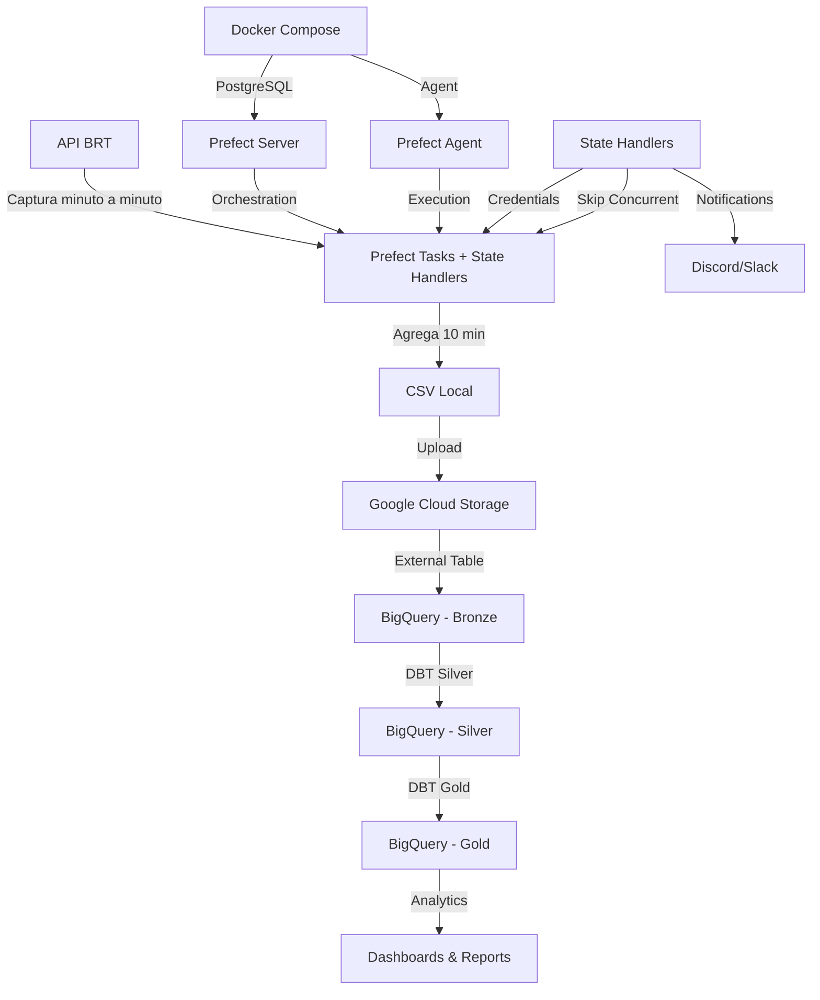

#  Desafio CIVITAS - Pipeline BRT Rio de Janeiro

[](https://docs.prefect.io/)
[](https://docs.getdbt.com/)
[](https://cloud.google.com/bigquery)
[](https://www.python.org/)

Pipeline de dados ELT para captura, armazenamento e transformação de dados GPS em tempo real dos veículos BRT do Rio de Janeiro, seguindo a **Arquitetura Medallion** (Bronze → Silver → Gold).

##  Índice

- [Visão Geral](#-visão-geral)
- [Arquitetura](#-arquitetura)
- [Tecnologias](#-tecnologias)
- [Pré-requisitos](#-pré-requisitos)
- [Instalação](#-instalação)
- [Configuração](#-configuração)
- [Execução](#-execução)
- [Estrutura do Projeto](#-estrutura-do-projeto)
- [Modelos DBT](#-modelos-dbt)
- [Testes de Qualidade](#-testes-de-qualidade)
- [Monitoramento](#-monitoramento)
- [Troubleshooting](#-troubleshooting)

##  Visão Geral

Este projeto implementa um pipeline completo de dados que:

1. **Captura** dados GPS dos veículos BRT minuto a minuto via API
2. **Agrega** 10 minutos de dados em um único arquivo CSV
3. **Armazena** no Google Cloud Storage (GCS)
4. **Cria** tabela externa no BigQuery usando DBT
5. **Transforma** dados através de modelos DBT (camadas Silver e Gold)
6. **Documenta** automaticamente tabelas e colunas no BigQuery

### Arquitetura Medallion

```

                     ARQUITETURA MEDALLION                   

                                                             
   API BRT                                                 
      ↓                                                      
   BRONZE (Raw Data)                                       
      • Captura minuto a minuto                              
      • CSV no GCS                                           
      • Tabela externa BigQuery                              
      ↓                                                      
   SILVER (Cleaned Data)                                   
      • Validação de coordenadas                             
      • Remoção de duplicatas                                
      • Campos derivados                                     
      • Views no BigQuery                                    
      ↓                                                      
   GOLD (Business Metrics)                                 
      • Métricas agregadas                                   
      • KPIs por linha e período                             
      • Tabelas particionadas                                
      • Pronto para dashboards                               
                                                             

```

##  Arquitetura



**Fluxo de Execução Seguindo Padrão CIVITAS**:
1. **Infraestrutura**: Docker Compose sobe Prefect Server + PostgreSQL + Agent
2. **Orquestração**: Prefect Server coordena execução com state handlers
3. **Extract**: Tasks capturam dados da API BRT (resiliente com retry)
4. **Buffer**: Agregação inteligente em janelas de 10 minutos
5. **Load**: Upload automatizado para GCS com validação
6. **Transform**: DBT executa transformações Bronze → Silver → Gold
7. **Quality**: Testes automáticos validam integridade dos dados
8. **Monitor**: State handlers injetam credenciais e notificam falhas

##  Tecnologias

- **Orquestração**: Prefect 1.4.1 Local Agent + PostgreSQL (Docker)
- **Transformação**: DBT 1.4.9 + dbt-bigquery 1.4.3
- **Cloud**: Google Cloud Platform (GCS + BigQuery)
- **Linguagem**: Python 3.10.11
- **Containerização**: Docker + Docker Compose
- **Logs**: Python Logging + Prefect Built-in

> **Nota Técnica**: Este projeto foi desenvolvido e testado com **Python 3.10.11**, **Prefect 1.4.1**, **DBT 1.4.9** e **dbt-bigquery 1.4.3** seguindo as especificações do desafio CIVITAS.

##  Pré-requisitos

### Software Necessário

- **Python 3.10.11** (versão validada e testada)
- Docker e Docker Compose (para Prefect Server)
- Git
- Conta Google Cloud Platform

> **Python 3.10.11 Validado**: Este projeto foi completamente testado com Python 3.10.11 garantindo compatibilidade com:
> - Prefect 1.4.1 (orquestração)
> - DBT 1.4.9 + dbt-bigquery 1.4.3 (transformações)
> - marshmallow 3.26.1, pendulum 2.1.2, numpy 1.24.4 (dependências críticas)
> - Google Cloud BigQuery + Storage SDKs

### Conta GCP

1. Criar projeto no [Google Cloud Console](https://console.cloud.google.com/)
2. Ativar APIs:
   - BigQuery API
   - Cloud Storage API
3. Criar Service Account com permissões:
   - BigQuery Admin
   - Storage Admin
4. Baixar arquivo JSON de credenciais

##  Instalação

### 1. Clone o Repositório

```bash
git clone https://github.com/seu-usuario/desafio-civitas-brt.git
cd desafio-civitas-brt
```

### 2. Verificar/Instalar Python 3.10

```bash
# Verificar versão atual
python --version

# Se não for 3.10.x, opções de instalação:

# OPÇÃO 1: Download direto (Windows)
# https://www.python.org/downloads/release/python-31012/

# OPÇÃO 2: Usando pyenv (Linux/Mac/Windows WSL)
# pyenv install 3.10.12
# pyenv local 3.10.12

# OPÇÃO 3: Usando conda
# conda create -n brt-pipeline python=3.10
# conda activate brt-pipeline

# OPÇÃO 4: Linux (Ubuntu/Debian)
# sudo apt update
# sudo apt install python3.10 python3.10-venv python3.10-dev
```

### 3. Crie Ambiente Virtual Python 3.10.11

```bash
# Windows (PowerShell) - TESTADO E VALIDADO
# Instalar Python 3.10 se não tiver:
winget install Python.Python.3.10

# Criar ambiente virtual
py -3.10 -m venv venv
.\venv\Scripts\Activate.ps1

# Linux/Mac
python3.10 -m venv venv
source venv/bin/activate

# Verificar versão no ambiente virtual
python --version  # DEVE mostrar Python 3.10.11
```

### 4. Instale Dependências

```bash
pip install --upgrade pip
pip install -r requirements.txt

# Verificar instalação do Prefect
prefect version  # Deve mostrar 1.4.1
```

### 4. Configure Credenciais GCP

Copie o arquivo de credenciais JSON para o diretório `config/`:

```bash
# Windows
New-Item -ItemType Directory -Force -Path config
Copy-Item caminho\para\suas-credenciais.json config\gcp-credentials.json

# Linux/Mac
mkdir -p config
cp /caminho/para/suas-credenciais.json config/gcp-credentials.json
```

##  Configuração

### 1. Variáveis de Ambiente

Copie o arquivo de exemplo e configure:

```bash
# Windows
Copy-Item .env.example .env

# Linux/Mac
cp .env.example .env
```

Edite o arquivo `.env`:

```bash
# Google Cloud Platform
GCP_PROJECT_ID=seu-projeto-gcp
GCS_BUCKET_NAME=brt-data-civitas
GCP_CREDENTIALS_PATH=./config/gcp-credentials.json

# BigQuery
BQ_DATASET=brt_dataset

# API BRT
BRT_API_URL=https://jeap.rio.rj.gov.br/je-api/api/v2/gps

# Configurações do Pipeline
CAPTURE_INTERVAL_SECONDS=60
AGGREGATION_MINUTES=10

# Prefect
PREFECT_SERVER_HOST=0.0.0.0
PREFECT_SERVER_PORT=4200
```

### 2. Criar Bucket GCS

```bash
# Via gcloud CLI
gcloud storage buckets create gs://brt-data-civitas --location=US

# OU via console: https://console.cloud.google.com/storage
```

### 3. Criar Dataset BigQuery

```bash
# Via bq CLI
bq mk --location=US brt_dataset

# OU via console: https://console.cloud.google.com/bigquery
```

### 4. Instalar Dependências DBT

```bash
cd dbt_brt
dbt deps
cd ..
```

##  Execução

### Execução com Docker (Padrão CIVITAS)

#### 1. Inicie a Infraestrutura

```bash
# Sobe Prefect Server + PostgreSQL + Agent
docker-compose up -d

# Aguarde ~60 segundos para inicialização completa
docker-compose ps
```

#### 2. Acesse a Interface

Abra no navegador: [http://localhost:4200](http://localhost:4200)

#### 3. Registre o Flow

```bash
# Ambiente de produção (execução minuto a minuto)
python pipeline/brt_flow.py --register

# Ambiente de desenvolvimento (execução horária)  
python pipeline/brt_flow.py --register --dev

# Ambiente de teste (dados mock)
python pipeline/brt_flow.py --register --test
```

#### 4. Monitore a Execução

No Prefect UI:
- Navegue até **"Flows"**
- Selecione **"CIVITAS: BRT Data Pipeline"**
- Clique em **"Quick Run"** para teste manual
- Monitore execuções automáticas baseadas no schedule

### Execução Local (Desenvolvimento/Debug)

```bash
# Execução única para desenvolvimento
python pipeline/brt_flow.py --run --dev

# Execução única para teste
python pipeline/brt_flow.py --run --test
```

### Teste Individual de Componentes

#### Teste Captura da API

```bash
python scripts/brt_api_capture.py
```

#### Teste Agregação

```bash
python scripts/brt_data_aggregator.py
```

#### Teste Upload GCS

```bash
python scripts/gcs_manager.py
```

#### Teste DBT

```bash
cd dbt_brt

# Cria tabela externa
dbt run-operation stage_external_sources

# Executa transformações
dbt run

# Executa testes
dbt test

# Gera documentação
dbt docs generate
dbt docs serve
```

##  Estrutura do Projeto

```
desafio-civitas-brt/
  README.md                    # Este arquivo
  requirements.txt             # Dependências Python
  docker-compose.yml           # Configuração Docker
  .env.example                 # Exemplo de variáveis de ambiente
  .gitignore

  pipeline/                    # Fluxos Prefect (Padrão CIVITAS)
    __init__.py
    brt_flow.py                 # Flow principal
    tasks.py                    # Tasks modulares
    schedules.py                # Configurações de agendamento
    state_handlers.py           # Handlers para credenciais e notificações

  scripts/                     # Scripts Python
    __init__.py
    brt_api_capture.py          # Captura da API
    brt_data_aggregator.py      # Agregação de dados
    gcs_manager.py              # Gerenciamento GCS

  dbt_brt/                     # Projeto DBT
    dbt_project.yml             # Configuração DBT
    profiles.yml                # Perfis de conexão
    packages.yml                # Dependências DBT
   
     models/                  # Modelos DBT
         bronze/              # Camada Bronze
           sources.yml         # Tabelas externas
       
         silver/              # Camada Silver
           stg_brt_gps_cleaned.sql
           schema.yml
       
         gold/                # Camada Gold
            fct_brt_line_metrics.sql
            schema.yml

  config/                      # Configurações
    gcp-credentials.json        # Credenciais GCP (não versionado)

  data/                        # Dados locais
    bronze/                     # Dados brutos
    silver/                     # Dados processados

  docs/                        # Documentação adicional
```

##  Modelos DBT

### Camada Bronze

**`brt_gps_raw`** (Tabela Externa)
- Dados brutos da API BRT
- Armazenados em CSV no GCS
- Schema fixo com 8 colunas

### Camada Silver

**`stg_brt_gps_cleaned`** (View)
-  Validação de coordenadas GPS
-  Remoção de duplicatas
-  Campos derivados (data, hora, dia da semana)
-  Categorização de velocidade
-  Identificação de período do dia

### Camada Gold

**`fct_brt_line_metrics`** (Tabela Particionada)
-  Métricas agregadas por linha e período
-  KPIs operacionais
-  Otimizada para dashboards
-  Particionada por data
-  Clusterizada por linha e período

##  Testes de Qualidade

O projeto implementa testes DBT em múltiplos níveis:

### Testes de Schema

```yaml
# Coluna não pode ser nula
- not_null

# Coluna deve ser única
- unique

# Valores aceitos
- accepted_values:
    values: ['Manhã', 'Tarde', 'Noite', 'Madrugada']
```

### Testes de Relacionamento

```yaml
# Combinação de colunas única
- dbt_utils.unique_combination_of_columns:
    combination_of_columns:
      - date_partition
      - line
      - period_of_day
```

### Testes de Valores

```yaml
# Valores dentro de um intervalo
- dbt_expectations.expect_column_values_to_be_between:
    min_value: -23.0
    max_value: -22.7
```

### Executar Testes

```bash
cd dbt_brt
dbt test
```

##  Monitoramento

### Prefect UI

Acesse: [http://localhost:4200](http://localhost:4200)

-  Status de execução dos flows
-  Histórico de runs
- ⏱ Duração das tasks
-  Logs de erros

### DBT Docs

```bash
cd dbt_brt
dbt docs generate
dbt docs serve
```

Acesse: [http://localhost:8080](http://localhost:8080)

-  Documentação de modelos
-  Lineage de dados
-  Schema das tabelas
-  Resultados dos testes

### Logs do Pipeline

Logs detalhados são salvos automaticamente com Loguru:

```bash
# Ver logs em tempo real
tail -f logs/brt_pipeline.log
```

##  Troubleshooting

### Problema: Erro de autenticação GCP

**Solução:**
```bash
# Verifique se o arquivo de credenciais existe
ls config/gcp-credentials.json

# Defina a variável de ambiente
export GOOGLE_APPLICATION_CREDENTIALS=./config/gcp-credentials.json
```

### Problema: Prefect Server não inicia

**Solução:**
```bash
# Verifique os logs
docker-compose logs prefect-server

# Reinicie os containers
docker-compose restart
```

### Problema: DBT não encontra tabelas

**Solução:**
```bash
# Verifique se a tabela externa foi criada
cd dbt_brt
dbt run-operation stage_external_sources

# Verifique no BigQuery se o dataset existe
bq ls
```

### Problema: API BRT não responde

**Solução:**
- Verifique se a URL está correta
- Teste manualmente: https://jeap.rio.rj.gov.br/je-api/api/v2/gps
- Aguarde alguns minutos (API pode ter rate limiting)

##  Commits Convencionais

Este projeto segue o padrão de [Conventional Commits](https://www.conventionalcommits.org/):

```bash
# Exemplos
git commit -m "feat: adiciona captura de dados da API BRT"
git commit -m "fix: corrige validação de coordenadas GPS"
git commit -m "docs: atualiza instruções de instalação"
git commit -m "test: adiciona testes de qualidade DBT"
git commit -m "refactor: melhora estrutura do agregador"
```

##  Contribuindo

1. Fork o projeto
2. Crie uma branch para sua feature (`git checkout -b feat/nova-feature`)
3. Commit suas mudanças (`git commit -m 'feat: adiciona nova feature'`)
4. Push para a branch (`git push origin feat/nova-feature`)
5. Abra um Pull Request

##  Licença

Este projeto foi desenvolvido como parte do desafio técnico para a vaga de Engenheiro de Dados na CIVITAS.

---

##  Links Úteis

- [Prefect v1 Docs](https://docs-v1.prefect.io/)
- [DBT Docs](https://docs.getdbt.com/)
- [BigQuery Docs](https://cloud.google.com/bigquery/docs)
- [API BRT Rio](https://jeap.rio.rj.gov.br/je-api/api/v2/gps)
- [GCP Free Tier](https://cloud.google.com/free)
- [Commits Convencionais](https://www.conventionalcommits.org/)

---

