# 🏗️ Arquitetura do Pipeline BRT - Diagrama Completo

```mermaid
---
title: Pipeline BRT CIVITAS - Arquitetura Medallion
---
flowchart TB
    %% Definição de estilos
    classDef bronze fill:#cd7f32,stroke:#8b4513,stroke-width:3px,color:#fff
    classDef silver fill:#c0c0c0,stroke:#808080,stroke-width:3px,color:#000
    classDef gold fill:#ffd700,stroke:#b8860b,stroke-width:3px,color:#000
    classDef prefect fill:#024dfd,stroke:#0134a6,stroke-width:2px,color:#fff
    classDef gcp fill:#4285f4,stroke:#1967d2,stroke-width:2px,color:#fff
    classDef api fill:#28a745,stroke:#1e7e34,stroke-width:2px,color:#fff
    
    %% API BRT
    API["🚌 API BRT<br/>jeap.rio.rj.gov.br/je-api/api/v2/gps"]:::api
    
    %% Prefect Flow
    subgraph PREFECT["🔄 Prefect Flow - Orquestração"]
        direction TB
        T1["📡 Task: Captura Dados<br/>(minuto a minuto)"]:::prefect
        T2["📊 Task: Buffer Agregação<br/>(10 capturas)"]:::prefect
        T3["💾 Task: Gera CSV<br/>(10 minutos de dados)"]:::prefect
        T4["☁️ Task: Upload GCS"]:::prefect
        T5["🔧 Task: DBT External Table"]:::prefect
        T6["🔄 Task: DBT Transformações"]:::prefect
        T7["🧪 Task: DBT Testes"]:::prefect
        
        T1 --> T2
        T2 --> T3
        T3 --> T4
        T4 --> T5
        T5 --> T6
        T6 --> T7
    end
    
    %% Storage Local
    LOCAL["💻 Storage Local<br/>data/bronze/<br/>data/silver/"]
    
    %% Google Cloud Platform
    subgraph GCP["☁️ Google Cloud Platform"]
        direction TB
        
        %% Cloud Storage
        GCS["📦 Google Cloud Storage<br/>gs://brt-data-civitas/brt-data/"]:::gcp
        
        %% BigQuery - Bronze
        subgraph BRONZE["🥉 CAMADA BRONZE - Raw Data"]
            direction LR
            BQ_EXT["📋 Tabela Externa<br/>brt_gps_raw<br/><br/>• Dados brutos<br/>• Schema fixo<br/>• 8 colunas"]:::bronze
        end
        
        %% BigQuery - Silver
        subgraph SILVER["🥈 CAMADA SILVER - Cleaned Data"]
            direction LR
            BQ_SILVER["🔍 View<br/>stg_brt_gps_cleaned<br/><br/>• Validação GPS<br/>• Deduplicação<br/>• Enriquecimento<br/>• Categorização"]:::silver
        end
        
        %% BigQuery - Gold
        subgraph GOLD["🥇 CAMADA GOLD - Business Metrics"]
            direction LR
            BQ_GOLD["📊 Tabela Particionada<br/>fct_brt_line_metrics<br/><br/>• Métricas agregadas<br/>• KPIs calculados<br/>• Particionada por data<br/>• Cluster: linha + período"]:::gold
        end
        
        GCS --> BQ_EXT
        BQ_EXT --> BQ_SILVER
        BQ_SILVER --> BQ_GOLD
    end
    
    %% Dashboards
    DASH["📈 Dashboards<br/>Looker Studio / Metabase<br/><br/>• Monitoramento em tempo real<br/>• Análise de performance<br/>• Identificação de padrões"]
    
    %% Documentação
    DOCS["📚 Documentação DBT<br/>dbt docs serve<br/><br/>• Lineage de dados<br/>• Schema documentado<br/>• Testes de qualidade"]
    
    %% Fluxo principal
    API ==>|"HTTP GET<br/>a cada 1 min"| T1
    T3 -->|"Salva local"| LOCAL
    T4 -->|"Upload CSV"| GCS
    
    %% DBT
    T5 -.->|"dbt run-operation<br/>stage_external_sources"| BQ_EXT
    T6 -.->|"dbt run<br/>models"| BQ_SILVER
    T6 -.->|"dbt run<br/>models"| BQ_GOLD
    T7 -.->|"dbt test"| DOCS
    
    %% Consumo
    BQ_GOLD ==>|"Query SQL"| DASH
    
    %% Anotações
    NOTE1["⏱️ Frequência:<br/>• Captura: 1 min<br/>• Agregação: 10 min<br/>• CSV diário: ~144 arquivos"]
    NOTE2["💰 Custo:<br/>• GCS: Grátis (<1GB)<br/>• BigQuery: Grátis (<10GB)<br/>• Total: $0/mês"]
    NOTE3["✅ Qualidade:<br/>• 27+ testes DBT<br/>• Validação GPS<br/>• Deduplicação<br/>• Documentação 100%"]
    
    %% Posicionamento das notas
    NOTE1 -.-> PREFECT
    NOTE2 -.-> GCP
    NOTE3 -.-> GOLD
```



## 📊 Detalhamento dos Componentes

### 1. API BRT (Fonte de Dados)
- **Endpoint:** `https://jeap.rio.rj.gov.br/je-api/api/v2/gps`
- **Método:** HTTP GET
- **Frequência:** Consulta a cada 1 minuto
- **Dados retornados:** GPS em tempo real dos veículos BRT

### 2. Prefect Flow (Orquestração)
- **Versão:** Prefect 1.4.1
- **Execução:** Docker Agent
- **Schedule:** Interval de 1 minuto
- **Retry:** 3 tentativas com delay de 30s

**Tasks:**
1. **Captura:** Consulta API e retorna DataFrame
2. **Buffer:** Mantém 10 capturas em memória
3. **CSV:** Gera arquivo quando buffer completo
4. **Upload:** Envia para GCS
5. **External Table:** Cria tabela externa no BigQuery
6. **Transformações:** Executa modelos Silver e Gold
7. **Testes:** Valida qualidade dos dados

### 3. Camada Bronze (Raw Data)
- **Tipo:** Tabela Externa BigQuery
- **Source:** CSV no GCS
- **Formato:** `gs://brt-data-civitas/brt-data/*.csv`
- **Schema:** 8 colunas (capture_timestamp, vehicle_id, line, latitude, longitude, speed, timestamp_gps, raw_data)
- **Característica:** Dados imutáveis, histórico completo

### 4. Camada Silver (Cleaned Data)
- **Tipo:** View BigQuery
- **Materialização:** Virtual (sem storage adicional)
- **Transformações:**
  - Validação de coordenadas GPS (Rio de Janeiro)
  - Remoção de duplicatas (QUALIFY ROW_NUMBER)
  - Campos derivados (data, hora, dia da semana)
  - Categorização de velocidade
  - Identificação de período do dia
  - Hash MD5 para rastreamento

### 5. Camada Gold (Business Metrics)
- **Tipo:** Tabela Particionada BigQuery
- **Particionamento:** Por data (PARTITION BY date_partition)
- **Clustering:** linha, period_of_day
- **Métricas:**
  - Total de veículos ativos
  - Velocidade média/min/max/stddev
  - Distribuição por categoria de velocidade
  - KPIs percentuais
  - Centro geográfico de operação

### 6. Dashboards & Visualização
- **Ferramenta sugerida:** Looker Studio / Metabase
- **Fonte:** Tabela Gold (fct_brt_line_metrics)
- **Casos de uso:**
  - Monitoramento em tempo real
  - Análise de performance operacional
  - Identificação de padrões de tráfego
  - Comparação entre linhas e períodos

### 7. Documentação DBT
- **Comando:** `dbt docs generate && dbt docs serve`
- **Recursos:**
  - Lineage de dados automático
  - Schema completo documentado
  - Resultados de testes
  - Propagação para BigQuery (+persist_docs)

## 🔄 Fluxo de Dados Detalhado

```
┌─────────────────────────────────────────────────────────────────┐
│ Minuto 1-10: COLETA                                             │
├─────────────────────────────────────────────────────────────────┤
│ 10:00 → API → DataFrame (100 veículos) → Buffer [1/10]         │
│ 10:01 → API → DataFrame (102 veículos) → Buffer [2/10]         │
│ 10:02 → API → DataFrame ( 98 veículos) → Buffer [3/10]         │
│ ...                                                             │
│ 10:09 → API → DataFrame (101 veículos) → Buffer [10/10] ✓      │
└─────────────────────────────────────────────────────────────────┘

┌─────────────────────────────────────────────────────────────────┐
│ Minuto 10: AGREGAÇÃO & UPLOAD                                  │
├─────────────────────────────────────────────────────────────────┤
│ Buffer completo → Concatena 10 DataFrames                       │
│ → CSV: brt_data_20251024_101000.csv (~1000 registros)          │
│ → Upload: gs://brt-data-civitas/brt-data/                      │
└─────────────────────────────────────────────────────────────────┘

┌─────────────────────────────────────────────────────────────────┐
│ TRANSFORMAÇÃO DBT                                               │
├─────────────────────────────────────────────────────────────────┤
│ 🥉 Bronze: Cria/atualiza tabela externa                        │
│    → brt_dataset.brt_gps_raw (aponta para GCS)                 │
│                                                                 │
│ 🥈 Silver: Executa view de limpeza                             │
│    → brt_dataset_silver.stg_brt_gps_cleaned                    │
│    → Valida GPS, deduplica, enriquece                          │
│    → ~950 registros válidos (50 removidos)                     │
│                                                                 │
│ 🥇 Gold: Executa agregação                                     │
│    → brt_dataset_gold.fct_brt_line_metrics                     │
│    → 12 linhas (3 linhas × 4 períodos do dia)                  │
│    → Métricas + KPIs prontos para dashboard                    │
└─────────────────────────────────────────────────────────────────┘

┌─────────────────────────────────────────────────────────────────┐
│ QUALIDADE & DOCUMENTAÇÃO                                        │
├─────────────────────────────────────────────────────────────────┤
│ 🧪 Testes: 27+ testes executados                               │
│    → Schema validation ✓                                       │
│    → Uniqueness checks ✓                                       │
│    → Value ranges ✓                                            │
│                                                                 │
│ 📚 Docs: Documentação atualizada                               │
│    → Lineage graph gerado                                      │
│    → Descrições propagadas para BigQuery                       │
└─────────────────────────────────────────────────────────────────┘
```

## 💡 Decisões de Arquitetura

### Por que Tabela Externa (Bronze)?
- ✅ Custo reduzido (storage em GCS mais barato)
- ✅ Separação de storage e compute
- ✅ Flexibilidade para processar dados brutos
- ⚠️ Trade-off: Performance de query inferior

### Por que View (Silver)?
- ✅ Sempre reflete dados mais recentes
- ✅ Sem custo de armazenamento adicional
- ✅ Queries otimizadas pelo BigQuery
- ⚠️ Trade-off: Recomputação a cada query

### Por que Tabela Particionada (Gold)?
- ✅ Performance otimizada (scan apenas partições necessárias)
- ✅ Custo reduzido em queries filtradas por data
- ✅ Ideal para dashboards com análises temporais

## 📈 Métricas de Performance

- **Latência total:** ~2-3 minutos (captura → disponibilidade Gold)
- **Volume diário:** ~144 CSVs, ~14.400-28.800 registros
- **Taxa de sucesso:** >99% (com retry automático)
- **Custo mensal:** $0 (dentro do Free Tier)

---

**Arquitetura projetada para: Escalabilidade, Confiabilidade, Custo-efetividade** 🚀
