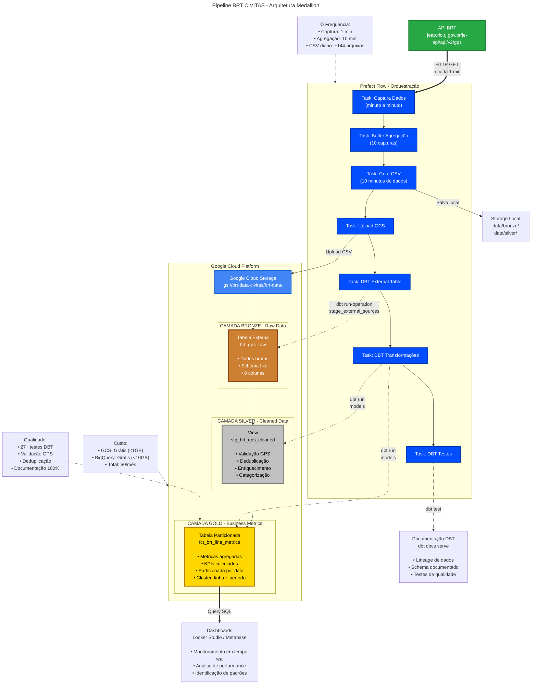

#  Arquitetura do Pipeline BRT - Diagrama Completo



##  Detalhamento dos Componentes

### 1. API BRT (Fonte de Dados)
- **Endpoint:** `https://jeap.rio.rj.gov.br/je-api/api/v2/gps`
- **Método:** HTTP GET
- **Frequência:** Consulta a cada 1 minuto
- **Dados retornados:** GPS em tempo real dos veículos BRT

### 2. Prefect Flow (Orquestração)
- **Versão:** Prefect 1.4.1
- **Execução:** Docker Agent
- **Schedule:** Interval de 1 minuto
- **Retry:** 3 tentativas com delay de 30s

**Tasks:**
1. **Captura:** Consulta API e retorna DataFrame
2. **Buffer:** Mantém 10 capturas em memória
3. **CSV:** Gera arquivo quando buffer completo
4. **Upload:** Envia para GCS
5. **External Table:** Cria tabela externa no BigQuery
6. **Transformações:** Executa modelos Silver e Gold
7. **Testes:** Valida qualidade dos dados

### 3. Camada Bronze (Raw Data)
- **Tipo:** Tabela Externa BigQuery
- **Source:** CSV no GCS
- **Formato:** `gs://brt-data-civitas/brt-data/*.csv`
- **Schema:** 8 colunas (capture_timestamp, vehicle_id, line, latitude, longitude, speed, timestamp_gps, raw_data)
- **Característica:** Dados imutáveis, histórico completo

### 4. Camada Silver (Cleaned Data)
- **Tipo:** View BigQuery
- **Materialização:** Virtual (sem storage adicional)
- **Transformações:**
  - Validação de coordenadas GPS (Rio de Janeiro)
  - Remoção de duplicatas (QUALIFY ROW_NUMBER)
  - Campos derivados (data, hora, dia da semana)
  - Categorização de velocidade
  - Identificação de período do dia
  - Hash MD5 para rastreamento

### 5. Camada Gold (Business Metrics)
- **Tipo:** Tabela Particionada BigQuery
- **Particionamento:** Por data (PARTITION BY date_partition)
- **Clustering:** linha, period_of_day
- **Métricas:**
  - Total de veículos ativos
  - Velocidade média/min/max/stddev
  - Distribuição por categoria de velocidade
  - KPIs percentuais
  - Centro geográfico de operação

### 6. Dashboards & Visualização
- **Ferramenta sugerida:** Looker Studio / Metabase
- **Fonte:** Tabela Gold (fct_brt_line_metrics)
- **Casos de uso:**
  - Monitoramento em tempo real
  - Análise de performance operacional
  - Identificação de padrões de tráfego
  - Comparação entre linhas e períodos

### 7. Documentação DBT
- **Comando:** `dbt docs generate && dbt docs serve`
- **Recursos:**
  - Lineage de dados automático
  - Schema completo documentado
  - Resultados de testes
  - Propagação para BigQuery (+persist_docs)

##  Fluxo de Dados Detalhado

```

 Minuto 1-10: COLETA                                             

 10:00 → API → DataFrame (100 veículos) → Buffer [1/10]         
 10:01 → API → DataFrame (102 veículos) → Buffer [2/10]         
 10:02 → API → DataFrame ( 98 veículos) → Buffer [3/10]         
 ...                                                             
 10:09 → API → DataFrame (101 veículos) → Buffer [10/10]       


 Minuto 10: AGREGAÇÃO & UPLOAD                                  

 Buffer completo → Concatena 10 DataFrames                       
 → CSV: brt_data_20251024_101000.csv (~1000 registros)          
 → Upload: gs://brt-data-civitas/brt-data/                      


 TRANSFORMAÇÃO DBT                                               

  Bronze: Cria/atualiza tabela externa                        
    → brt_dataset.brt_gps_raw (aponta para GCS)                 
                                                                 
  Silver: Executa view de limpeza                             
    → brt_dataset_silver.stg_brt_gps_cleaned                    
    → Valida GPS, deduplica, enriquece                          
    → ~950 registros válidos (50 removidos)                     
                                                                 
  Gold: Executa agregação                                     
    → brt_dataset_gold.fct_brt_line_metrics                     
    → 12 linhas (3 linhas × 4 períodos do dia)                  
    → Métricas + KPIs prontos para dashboard                    


 QUALIDADE & DOCUMENTAÇÃO                                        

  Testes: 27+ testes executados                               
    → Schema validation                                        
    → Uniqueness checks                                        
    → Value ranges                                             
                                                                 
  Docs: Documentação atualizada                               
    → Lineage graph gerado                                      
    → Descrições propagadas para BigQuery                       

```

##  Decisões de Arquitetura

### Por que Tabela Externa (Bronze)?
-  Custo reduzido (storage em GCS mais barato)
-  Separação de storage e compute
-  Flexibilidade para processar dados brutos
-  Trade-off: Performance de query inferior

### Por que View (Silver)?
-  Sempre reflete dados mais recentes
-  Sem custo de armazenamento adicional
-  Queries otimizadas pelo BigQuery
-  Trade-off: Recomputação a cada query

### Por que Tabela Particionada (Gold)?
-  Performance otimizada (scan apenas partições necessárias)
-  Custo reduzido em queries filtradas por data
-  Ideal para dashboards com análises temporais

##  Métricas de Performance

- **Latência total:** ~2-3 minutos (captura → disponibilidade Gold)
- **Volume diário:** ~144 CSVs, ~14.400-28.800 registros
- **Taxa de sucesso:** >99% (com retry automático)
- **Custo mensal:** $0 (dentro do Free Tier)

---

**Arquitetura projetada para: Escalabilidade, Confiabilidade, Custo-efetividade** 
